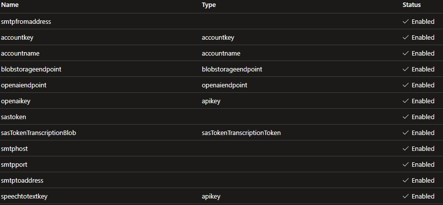

# Azure-Speech-To-Text-Analysis

This initiative, undertaken by three student developers from YRGO in collaboration with Herrljunga and Vårgårda municipality,
aims to streamline the transcription and analysis process of calls received by the service desk.
Built upon Java 17, the project seamlessly integrates Azure Speech to Text functionality to accurately transcribe incoming calls.
Leveraging the analytical capabilities of OpenAI, the transcribed text is subjected to in-depth analysis,
providing invaluable insights into the nature and content of the calls.
Subsequently,the analyzed data is formatted into JSON files, enabling efficient storage and retrieval.

## Before use there are some requirements:

- Java 17
- JRE (Java Runtime Environment) [Download Java](https://www.oracle.com/java/technologies/javase/jdk17-archive-downloads.html)
- Maven [Download Maven](https://maven.apache.org/download.cgi)
- Azure Speech To Text
- Azure OpenAi
- Blob storage (or any place to store audio/text files)
- Key vault to store secrets and keys (can be stored in any way you wish)

## Developer Knowledge:

- Java
- API usage

------------

## Configuring

- Set up necessary keys and refer to them in Utils/Config (if using key vault, refer to the name you set)
- Set up Ai model, can be found and set up when signed in to Azure Portal under Azure OpenAi, Model deployments
- To change the output format or add/remove anything you can edit the main prompt.
  We would recommend to follow the prompt style used.

### Key vault setup

| Key                  | Description                                                                                    |
|----------------------|------------------------------------------------------------------------------------------------|
| `Blob SAS token`     | Can be generated when signed in to Azure Portal under Storage account, Shared access signature |
| `Open AI key`        | Can be found when signed in to Azure Portal under Azure OpenAi, Keys and Endpoint              |
| `Speech to text key` | Can be found when signed in to Azure Portal under Speech service, Keys and Endpoint            |
------------


### Setup key vault authentication on local machine:

To run az commands in Powershell or other terminal you need to install [Azure CLI](https://learn.microsoft.com/en-us/cli/azure/install-azure-cli)

```Shell
setx KEY_VAULT_NAME "Your-Key-Vault-Name"
```

```Shell
az login
```

```Shell
az keyvault set-policy --name Your-Key-Vault-Name --upn user@domain.com --secret-permissions delete get list set purge
```

------------

## How the application works:

#### 1. Using Batch Transcription to transcribe multiple files simultaneously

#### 2. Creates a thread for each transcription

#### 3. Analyzing the transcribed text using Azure OpenAi

#### 4. Saving output to dedicated storage as json format

#### 5. Removes the original audio file from storage

#### 6. If you wish to compile the program in to a .jar file, run
```Shell
mvn clean compile assembly:single
```
 in root folder.

## Errors

### Handling Error Code 429:
#### If you encounter error code 429 while running the program, it indicates that you've likely exhausted your token allowance. To mitigate this issue, consider reducing the value of the "maxThreadsForAnalysis" parameter in the configuration file. Decreasing this value can help manage token usage and prevent further occurrences of error code 429.

### Configuring Content Filtering:
#### If you encounter issues related to content filtering, you can establish a content filter through your Azure portal. Setting up a content filter allows you to manage and regulate the type of content processed by the program, ensuring compliance with your requirements and standards.
